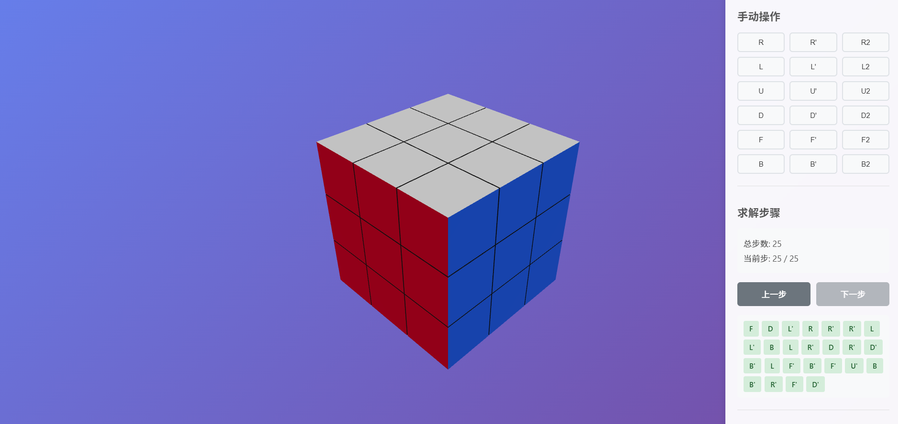

# Rubik's Cube Solver

An online Rubik's Cube solver built with React and Three.js, featuring 3D visualization, manual manipulation, and automatic solving capabilities.

## Features

- 🎲 **3D Visualization**: Realistic 3D Rubik's Cube rendering using Three.js
- 🎮 **Interactive Controls**: Mouse rotation, zoom, and manual face rotation
- 🔄 **Scramble Function**: Randomly scramble the cube
- 🤖 **Multiple Solving Algorithms**: Support for various solving algorithms
- 🎬 **Smooth Animations**: 3D rotation animations for all moves
- 📊 **Step-by-step Playback**: View solution steps and replay them step by step
- 📷 **Camera Input**: Capture cube state using camera with color recognition
- 🎨 **Manual Color Input**: Intuitive 6-face unfolded layout with simple color picker

## Architecture

### Design Overview

The application is built with a component-based architecture:

- **State Management**: React hooks (`useState`, `useRef`, `useEffect`) for managing cube state, animations, and solution steps
- **3D Rendering**: Three.js with React Three Fiber for efficient 3D rendering
- **Animation System**: Custom animation system that rotates cubies around face centers
- **Solver Integration**: Modular solver system supporting multiple algorithms

### Core Components

- **`App.tsx`**: Main application component managing global state and event handlers
- **`RubiksCube.tsx`**: 3D cube rendering component with animation support
- **`Cubie.tsx`**: Individual cubie component (face colors)
- **`ControlPanel.tsx`**: UI controls for scrambling, solving, and manual moves
- **`CameraInputModal.tsx`**: Camera-based cube state input with color recognition
- **`CubeNetInput.tsx`**: Unfolded 6-face input layout for manual color adjustment
- **`SimpleColorPicker.tsx`**: Simple 2x3 grid color picker for quick color selection

### Core Utilities

- **`cubeTypes.ts`**: TypeScript type definitions for cube state, moves, and colors
- **`cubieBasedCubeLogic.ts`**: Cubie-based cube rotation logic and state manipulation
- **`cubeAnimation.ts`**: Animation system for smooth 3D rotations
- **`cubeSolver.ts`**: Solver dispatcher supporting multiple algorithms
- **`idaStarHelpers.ts`**: IDA* state keys, fast equality, Manhattan sums
- **`cubeConverter.ts`**: Conversion between internal state and external formats (cubestring)
- **`thistlethwaite.ts`**: Thistlethwaite four-stage algorithm implementation
- **`cameraColorRecognition.ts`**: Camera-based color recognition utilities
- **`cubeInputConverter.ts`**: Conversion between input state and cube state
- **`faceColorsToCubieBased.ts`**: Conversion from facelet colors to cubie-based state
- **`cubestringCodec.ts`**: Single place for Kociemba cubestring (54 chars, URFDLB): `parseCubestring` / `serializeCubeState`, `cubieFromCubestring`, `applyMovesToCubestring`, `cubieBasedStateToCanonicalCubestring`
- **`solverFromCubestring.ts`**: Thin wrappers `solveIDAStarFromCubestring` / `solveThistlethwaiteFromCubestring` for tests and tooling

### Algorithm verification (cubestring + unit tests)

Solver outputs can be checked **without the 3D view**: apply the returned `Move[]` to the starting cubestring and compare to the solved string (`UUUU…BBBB`). **Ground truth for correctness is the codec + tests**, with 3D as optional confirmation.

- **Tier 0** (fast): `src/utils/cubestringCodec.test.ts` — parse/serialize roundtrip and move identities.
- **Tier 1–3** (slow): `src/utils/solverFromCubestring.test.ts` — IDA* / Thistlethwaite restore checks; the heavy block is **`describe.skip` by default**; remove `.skip` when you want to run them (`npm run test:run`).
- Scripts: `npm run test` (watch), `npm run test:run` (CI-style single run).

Design notes: [`doc/SOLVER_REFACTOR_AND_TEST_PLAN.md`](./doc/SOLVER_REFACTOR_AND_TEST_PLAN.md).

## Supported Algorithms

The application supports multiple solving algorithms, selectable via the UI:

**Status Summary:**
- ✅ **Reverse Moves**: Fully functional
- ✅ **Kociemba**: Fully functional (using kociemba-wasm)
- ✅ **IDA***: Phased IDA* search for random scrambles; shallow states still use exact full-space IDA*
- ✅ **Thistlethwaite**: Fully functional four-stage solver with table-backed phases

### 1. Reverse Moves (Default)
- **Speed**: ⚡⚡⚡⚡⚡ (Fastest)
- **Requirements**: Requires scramble sequence history
- **Description**: Simply reverses the scramble sequence. Perfect for states generated by the scramble function.
- **Use Case**: Best for testing and when scramble history is available

### 2. Kociemba Algorithm
- **Speed**: ⚡⚡⚡⚡ (Fast)
- **Requirements**: Valid cubestring format
- **Description**: Two-phase algorithm using the `kociemba-wasm` library. Provides near-optimal solutions. Fully supports cubestring format (54 characters).
- **Use Case**: General-purpose solving when scramble history is not available
- **Status**: ✅ Fully functional and tested

### 3. IDA* (Iterative Deepening A*)
- **Status**: ✅ Supports random scrambles via phased IDA*
- **Speed**: ⚡⚡ (Slow)
- **Requirements**: None
- **Description**: Uses exact full-space IDA* for shallow states, then switches to staged IDA* with table-backed admissible heuristics for random scrambles.
- **Use Case**: When you want an in-house IDA* search path besides Kociemba/Thistlethwaite
- **Implementation notes**: See [`doc/IDA_STAR_SOLVER.md`](./doc/IDA_STAR_SOLVER.md) for the current algorithm flow, pruning, and known limitations. Broader comparison (Columbia PDB/Kociemba notes, Jai0212, optimization ideas): [`doc/RUBIK_SOLVER_COMPARISON.md`](./doc/RUBIK_SOLVER_COMPARISON.md).
- **Debug logging** (when solve hangs or takes too long): In the browser **Console**, run `localStorage.setItem('DEBUG_IDA_STAR', 'true')`, **reload the page**, then run IDA* again. Console will show `[IDA*]` messages. To disable: `localStorage.removeItem('DEBUG_IDA_STAR')` and reload. Details: [§12.1 in `doc/IDA_STAR_SOLVER.md`](./doc/IDA_STAR_SOLVER.md).
- **Wall-clock limit**: Full-space IDA* stops after **5 minutes** by default. Random scrambles use phased IDA* instead.
- **Limitations**: 
  - Phased mode does not guarantee a globally shortest solution
  - First run builds abstract distance tables; later solves reuse in-memory caches

### 4. Thistlethwaite Algorithm
- **Status**: ✅ Fully functional and tested
- **Speed**: ⚡⚡⚡ (Moderate after first table build)
- **Requirements**: None
- **Description**: Four-stage algorithm that progressively restricts the cube to subgroups. It uses precomputed/derived abstract tables for EO, corner orientation + E-slice, G2→G3 cosets, and the half-turn group.
- **Use Case**: Educational purposes, understanding group theory approach
- **Limitations**: 
  - First run builds several in-memory tables; later solves on the same page are much faster
  - Solution length is phase-oriented and not globally optimal

## Current Issues

### Known Problems

1. **Animation State Update Race Condition**
   - **Issue**: When clicking "Next Step" very quickly after solving, the cube may not be correctly restored
   - **Root Cause (corrected)**: `currentStep` was incremented even when a new turn animation did not start (e.g. click while the previous rotation was still running), so the step index diverged from the number of `applyMove` commits. The solve-only `isAnimating` flag did not disable controls during cube rotation.
   - **Impact**: Rapid clicks could skip moves relative to the solution list
   - **Status**: Addressed in code; see [`doc/ANIMATION_STEP_RACE.md`](./doc/ANIMATION_STEP_RACE.md)
   - **Workaround (if using an older build)**: Wait for each animation to complete before clicking the next step

2. **Animation Reset**
   - **Issue**: After animation completes, cubies are reset to their original positions before the new state is applied
   - **Impact**: Brief visual glitch during state transition
   - **Status**: Minor issue, does not affect functionality

### Future Improvements

- Prewarm solver tables in a Web Worker to avoid first-click table-build cost on the main thread
- Add solution step auto-playback with configurable speed
- Add move notation display (e.g., "R U R' U'")
- Improve animation smoothness and add easing functions
- Add cube state import/export functionality
- Support for different cube sizes (2x2, 4x4, etc.)

## Technology Stack

- **React 18** - UI framework
- **Three.js** - 3D graphics rendering
- **@react-three/fiber** - React Three.js renderer
- **@react-three/drei** - Three.js utilities
- **kociemba-wasm** - Kociemba algorithm library (WebAssembly implementation)
- **TypeScript** - Type safety
- **Vite** - Build tool and dev server

## Installation and Usage

### Prerequisites

- Node.js 16+ and npm

### Installation

1. Install dependencies:
```bash
npm install
```

2. Start development server:
```bash
npm run dev
```

3. Build for production:
```bash
npm run build
```

### Troubleshooting (Vite dev)

If the console shows `GET http://127.0.0.1:5173/ net::ERR_CONNECTION_REFUSED` and `ping` / `waitForSuccessfulPing` from `client`:

- This comes from **Vite’s HMR client**, not your app code. It means the **dev server is not listening** (e.g. `npm run dev` was stopped).
- **Fix:** run `npm run dev` again and open the URL printed in the terminal; close stale tabs that still point at the old dev server.

See [`doc/VITE_DEV_TROUBLESHOOTING.md`](./doc/VITE_DEV_TROUBLESHOOTING.md) for details.

### Usage

1. **Rotate View**: Left mouse button drag
2. **Zoom**: Mouse wheel
3. **Scramble**: Click "Scramble" button
4. **Manual Moves**: Click rotation buttons in control panel (R, R', L, L', etc.)
5. **Camera Input**: 
   - Click "Camera Input" button to open camera input modal
   - Click center block of each face to activate camera
   - Position cube in front of camera and click center block again to recognize colors
   - Click edge blocks to manually adjust colors using the simple color picker
   - All 6 faces are displayed in an unfolded layout for easy input
6. **Solve**: 
   - Select an algorithm from the dropdown
   - Click "Solve" button
   - Use "Previous Step"/"Next Step" buttons to navigate through solution

## Project Structure

```
src/
  ├── components/              # React components
  │   ├── RubiksCube.tsx      # 3D cube rendering component
  │   ├── Cubie.tsx           # Individual cubie component
  │   ├── ControlPanel.tsx    # Control panel UI
  │   ├── CameraInputModal.tsx # Camera input modal
  │   ├── CubeNetInput.tsx    # Unfolded 6-face input layout
  │   └── SimpleColorPicker.tsx # Simple color picker (2x3 grid)
  ├── utils/                  # Utility functions
  │   ├── cubeTypes.ts        # TypeScript type definitions
  │   ├── cubieBasedCubeLogic.ts # Cubie-based cube rotation logic
  │   ├── cubeAnimation.ts    # Animation system
  │   ├── cubeSolver.ts       # Solver dispatcher
  │   ├── idaStarHelpers.ts   # IDA* helpers (state key, Manhattan)
  │   ├── cubeConverter.ts    # State format conversion
  │   ├── thistlethwaite.ts    # Thistlethwaite algorithm
  │   ├── cameraColorRecognition.ts # Camera color recognition
  │   ├── cubeInputConverter.ts # Input state conversion
  │   └── faceColorsToCubieBased.ts # Facelet to cubie conversion
  ├── App.tsx                 # Main application component
  └── main.tsx                # Entry point
```

## Future Optimization Plans

See [OPTIMIZATION_PLAN.md](./doc/OPTIMIZATION_PLAN.md) for detailed plans on:
- Camera-based initial state input system
- Cubie-based data structure refactoring
- Texture marking system for cubies

## License

MIT

---

# 魔方还原程序

一个基于 React + Three.js 的在线魔方还原程序，支持3D可视化、手动操作和自动求解功能。

## 功能特性

- 🎲 **3D可视化**：使用 Three.js 渲染逼真的3D魔方
- 🎮 **交互操作**：支持鼠标旋转视角、缩放，以及手动旋转魔方面
- 🔄 **打乱功能**：随机打乱魔方
- 🤖 **多种求解算法**：支持多种求解算法
- 🎬 **平滑动画**：所有移动都有3D旋转动画
- 📊 **步骤回放**：查看求解步骤并逐步回放
- 📷 **摄像头录入**：使用摄像头识别魔方颜色状态
- 🎨 **手动颜色录入**：直观的展开图式六面录入界面，配备简洁的颜色选择器

## 架构设计

### 设计概览

应用程序采用基于组件的架构：

- **状态管理**：使用 React hooks (`useState`, `useRef`, `useEffect`) 管理魔方状态、动画和求解步骤
- **3D渲染**：使用 Three.js 和 React Three Fiber 进行高效的3D渲染
- **动画系统**：自定义动画系统，围绕面的中心旋转小块
- **求解器集成**：模块化求解器系统，支持多种算法

### 核心组件

- **`App.tsx`**：主应用组件，管理全局状态和事件处理
- **`RubiksCube.tsx`**：3D魔方渲染组件，支持动画
- **`Cubie.tsx`**：单个小块组件（各面颜色）
- **`ControlPanel.tsx`**：打乱、求解和手动操作的UI控制面板

### 核心工具

- **`cubeTypes.ts`**：魔方状态、移动和颜色的 TypeScript 类型定义
- **`cubeLogic.ts`**：核心魔方旋转逻辑和状态操作
- **`cubeAnimation.ts`**：平滑3D旋转的动画系统
- **`cubeSolver.ts`**：支持多种算法的求解器调度器
- **`idaStarHelpers.ts`**：IDA* 状态键、快速判等、Manhattan 启发辅助
- **`cubeConverter.ts`**：内部状态和外部格式（cubestring）之间的转换
- **`thistlethwaite.ts`**：Thistlethwaite 四阶段算法实现

## 支持的算法

应用程序支持多种求解算法，可通过UI选择：

**状态总结：**
- ✅ **反向移动**：完全功能正常
- ✅ **Kociemba**：完全功能正常（使用 kociemba-wasm）
- ✅ **IDA***：支持随机打乱的分阶段 IDA* 搜索；浅层状态仍使用完整空间 IDA*
- ✅ **Thistlethwaite**：表驱动四阶段算法，已支持随机打乱

### 1. 反向移动（默认）
- **速度**：⚡⚡⚡⚡⚡（最快）
- **要求**：需要打乱序列历史
- **描述**：简单地反转打乱序列。非常适合由打乱功能生成的状态。
- **使用场景**：测试和当有打乱历史时最佳

### 2. Kociemba 算法
- **速度**：⚡⚡⚡⚡（快速）
- **要求**：有效的 cubestring 格式
- **描述**：使用 `kociemba-wasm` 库的两阶段算法。提供接近最优的解。完全支持 cubestring 格式（54字符）。
- **使用场景**：当没有打乱历史时的一般用途求解
- **状态**：✅ 完全功能正常并已测试

### 3. IDA*（迭代加深A*）
- **状态**：✅ 支持随机打乱（分阶段 IDA*）
- **速度**：⚡⚡（较慢）
- **要求**：无
- **描述**：浅层状态使用完整空间 IDA*；随机打乱使用带抽象距离表启发的分阶段 IDA*，不再依赖打乱历史逆序。
- **实现说明**：详见 [`doc/IDA_STAR_SOLVER.md`](./doc/IDA_STAR_SOLVER.md)（当前逻辑、剪枝与已知局限）。与外部资料（Columbia IDA\*+PDB 报告、[Jai0212](https://github.com/Jai0212/Rubiks-Cube-Solver-Using-IDA-Star) 等）的综合对比与优化方向见 [`doc/RUBIK_SOLVER_COMPARISON.md`](./doc/RUBIK_SOLVER_COMPARISON.md)。
- **调试日志**（求解很久无结果或需排查时）：浏览器打开**开发者工具 → 控制台**，执行 `localStorage.setItem('DEBUG_IDA_STAR', 'true')` 后**刷新页面**，再选 IDA* 求解，控制台会输出带 `[IDA*]` 的日志；关闭：`localStorage.removeItem('DEBUG_IDA_STAR')` 并刷新。步骤说明见 [`doc/IDA_STAR_SOLVER.md`](./doc/IDA_STAR_SOLVER.md) 中的 **§12.1 调试日志**。
- **默认 5 分钟总时长上限**：完整空间 IDA* 超时自动放弃（控制台有 `[IDA*] 已达总时长上限` 提示）。随机打乱会进入分阶段 IDA*。
- **使用场景**：需要观察 IDA* 搜索过程，或作为 Kociemba/Thistlethwaite 之外的自研求解路径
- **限制**：
  - 分阶段模式不保证全局最短解
  - 首次运行需要构建抽象距离表，之后同页内会复用缓存

### 4. Thistlethwaite 算法
- **状态**：✅ 已可用并通过随机打乱校验
- **速度**：⚡⚡⚡（首次构建距离表较慢，之后同页内复用缓存会明显变快）
- **要求**：无
- **描述**：四阶段算法，逐步将魔方限制到子群；当前实现使用抽象距离表和分阶段搜索，不依赖反向打乱历史。
- **使用场景**：需要观察 Thistlethwaite 分阶段路径，或作为 Kociemba 之外的自研求解器
- **限制**：
  - 首次运行需要构建抽象距离表，后续求解会复用内存缓存
  - 分阶段解不保证全局最短
  - 在非常复杂或异常状态上仍可能触发超时保护

## 当前问题

### 已知问题

1. **动画状态更新竞态条件**
   - **问题**：求解后快速点击"下一步"时，魔方可能无法正确还原
   - **根本原因（更正）**：在上一段转动动画尚未开始时若重复点击，`currentStep` 仍会增加，但 `applyMove` 只在动画结束时提交，导致步骤索引与真实转动次数不一致；用于求解的 `isAnimating` 未覆盖魔方转动动画期间的禁用逻辑。
   - **影响**：过快点击可能导致相对解法序列「跳步」
   - **状态**：已在代码中修复；说明见 [`doc/ANIMATION_STEP_RACE.md`](./doc/ANIMATION_STEP_RACE.md)
   - **变通（旧版本）**：在点击下一步前等待每个动画完成

2. **动画重置**
   - **问题**：动画完成后，小块在应用新状态之前会重置到原始位置
   - **影响**：状态转换期间的短暂视觉故障
   - **状态**：小问题，不影响功能

### 未来改进

- 将 Thistlethwaite / 分阶段 IDA* 的距离表预热迁移到 Web Worker，降低首次求解等待感
- 添加可配置速度的求解步骤自动回放
- 添加移动符号显示（例如 "R U R' U'"）
- 改善动画平滑度并添加缓动函数
- 添加魔方状态导入/导出功能
- 支持不同大小的魔方（2x2、4x4等）

## 技术栈

- **React 18** - UI框架
- **Three.js** - 3D图形渲染
- **@react-three/fiber** - React Three.js 渲染器
- **@react-three/drei** - Three.js 工具库
- **kociemba-wasm** - Kociemba 算法库（WebAssembly 实现）
- **TypeScript** - 类型安全
- **Vite** - 构建工具和开发服务器

## 安装和使用

### 前置要求

- Node.js 16+ 和 npm

### 安装

1. 安装依赖：
```bash
npm install
```

2. 启动开发服务器：
```bash
npm run dev
```

3. 构建生产版本：
```bash
npm run build
```

### 常见问题（Vite 开发）

若控制台出现 `GET http://127.0.0.1:5173/ net::ERR_CONNECTION_REFUSED` 以及 `client` 里的 `ping`：

- 这是 **Vite 热更新客户端** 在检测开发服务，**不是业务代码报错**；表示 **5173 端口上没有开发服务**（例如已关掉 `npm run dev`）。
- **处理：** 重新执行 `npm run dev`，用终端里显示的地址打开页面；关掉仍指向旧地址的标签页。

详见 [`doc/VITE_DEV_TROUBLESHOOTING.md`](./doc/VITE_DEV_TROUBLESHOOTING.md)。

### 使用方法

1. **旋转视角**：鼠标左键拖拽
2. **缩放**：鼠标滚轮
3. **打乱魔方**：点击"打乱"按钮
4. **手动操作**：点击控制面板中的旋转按钮（R, R', L, L'等）
5. **摄像头录入**：
   - 点击"摄像头录入"按钮打开录入界面
   - 点击每个面的中心块激活摄像头
   - 将魔方对准摄像头，再次点击中心块识别颜色
   - 点击边缘色块可手动调整颜色（使用简洁的2x3颜色选择器）
   - 六个面以展开图形式显示，方便录入
6. **自动求解**：
   - 从下拉菜单中选择算法
   - 点击"求解"按钮
   - 使用"上一步"/"下一步"按钮逐步查看求解过程

## 项目结构

```
src/
  ├── components/              # React组件
  │   ├── RubiksCube.tsx      # 3D魔方渲染组件
  │   ├── Cubie.tsx           # 单个小块组件
  │   ├── ControlPanel.tsx    # 控制面板UI
  │   ├── CameraInputModal.tsx # 摄像头录入模态框
  │   ├── CubeNetInput.tsx    # 展开图式六面录入界面
  │   └── SimpleColorPicker.tsx # 简洁颜色选择器（2x3网格）
  ├── utils/                  # 工具函数
  │   ├── cubeTypes.ts        # TypeScript类型定义
  │   ├── cubieBasedCubeLogic.ts # 基于Cubie的魔方旋转逻辑
  │   ├── cubeAnimation.ts    # 动画系统
  │   ├── cubeSolver.ts       # 求解器调度器
  │   ├── idaStarHelpers.ts   # IDA* 辅助（状态键、Manhattan）
  │   ├── cubeConverter.ts    # 状态格式转换
  │   ├── thistlethwaite.ts   # Thistlethwaite算法
  │   ├── cameraColorRecognition.ts # 摄像头颜色识别
  │   ├── cubeInputConverter.ts # 录入状态转换
  │   └── faceColorsToCubieBased.ts # 面颜色到Cubie转换
  ├── App.tsx                 # 主应用组件
  └── main.tsx                # 入口文件
```

## 未来优化计划

详见 [OPTIMIZATION_PLAN.md](./doc/OPTIMIZATION_PLAN.md)，包括：
- 基于摄像头的初始状态录入系统
- 基于 Cubie 的数据结构重构
- Cubie 纹理标记系统

## 许可证

MIT
